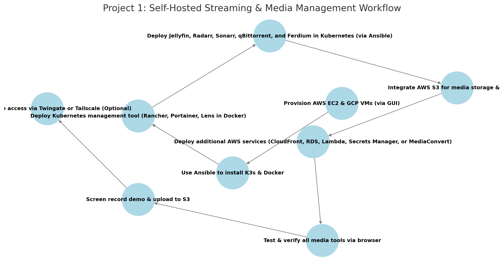

# **AWS Project Thread 1: Self-Hosted Streaming & Media Management Platform for Deployed Military Personnel**  

## **Scenario: Military Media Access in Remote & Secure Environments**  

### **Background**  
The **U.S. military** operates in locations where **internet connectivity is limited, restricted, or non-existent**. Streaming services such as **Netflix, Hulu, and Disney+ are often unavailable** due to network restrictions or licensing issues. This limits the ability of service members to access entertainment, training videos, or unit-level multimedia content.  

The **Morale, Welfare, and Recreation (MWR) programs** need a **self-hosted, locally managed media streaming solution** that allows military personnel to **store, organize, and stream** movies, TV shows, and military training content without internet dependency.  

This project will deploy **Jellyfin**, a self-hosted **media streaming platform**, along with **automated media acquisition and management tools**, ensuring a **continuous and legally obtained library** of media content. The system will be **distributed across AWS and GCP** for redundancy, with **Ansible for automation** and **AWS services for storage, caching, security, and access control**.  

---

## **Project Requirements**  

### ✅ **Deploy 4-5 Virtual Machines** *(via AWS & GCP GUI)*  
- **3 in AWS** (EC2 instances)  
- **1-2 in GCP** (Compute Engine VMs)  

### ✅ **Use Ansible to Automate**  
- **Install K3s & Docker** on all nodes.  
- **Deploy Kubernetes management tool** *(Rancher, Portainer, or Lens in a standalone Docker container)*.  
- **Deploy all media streaming and automation services in K3s**.  

### ✅ **Deploy & Expose the Following Media Services** *(Accessible via Browser & Local Network Players)*  
- **Kubernetes Management Tool** *(Rancher, Portainer, or Lens - deployed via Ansible in a standalone Docker container)*.  
- **Jellyfin** *(Self-hosted media streaming service for movies & TV shows)*.  
- **Radarr** *(Automated movie collection management & download organization)*.  
- **Sonarr** *(Automated TV show collection management & episode tracking)*.  
- **qBittorrent** *(For legally downloaded, public-domain media acquisition in a controlled environment.)*  
- **Ferdium** *(Integrated dashboard for centralizing access to all media services.)*  

### ✅ **Integrate AWS Services (Total: 5)**  
- **Mandatory AWS Services:**  
  - **EC2** – Deploy virtual machines for the media streaming platform.  
  - **S3** – Store backups, metadata, and library content.  

- **Choose 3 Additional AWS Services from the Following:**  
  - **AWS CloudFront** – Content Delivery Network (CDN) to optimize and cache media streaming.  
  - **AWS RDS** – Managed database service for metadata storage and user accounts.  
  - **AWS Lambda** – Automate media processing tasks (e.g., metadata updates, file organization).  
  - **AWS Secrets Manager** – Secure storage of API keys and authentication credentials.  
  - **AWS MediaConvert** – Transcode and optimize videos for different devices and bandwidth conditions.  

### ✅ **Upload & Access Demo Content**  
- **Record a project demo/video** and upload to an **S3 bucket**.  
- **Ensure movies & TV shows are available and streamable via Jellyfin**.  

### ✅ *(Optional)* Secure Remote Access with Twingate or Tailscale  
- **If required, implement Twingate or Tailscale for secure external access to media services**.  

---

## **Role of Each Tool**  

### **AWS Services**  
- **EC2** – Hosts 3 virtual machines for the media streaming cluster.  
- **S3** – Stores media backups, metadata, and subtitle files.  
- **CloudFront (Optional)** – Improves video streaming performance with caching.  
- **RDS (Optional)** – Stores Jellyfin metadata and user libraries.  
- **Lambda (Optional)** – Automates metadata updates and file renaming.  
- **Secrets Manager (Optional)** – Secures API keys and credentials.  
- **MediaConvert (Optional)** – Optimizes and converts videos for better compatibility.  

### **Ansible**  
- **Install K3s** on all nodes.  
- **Install Docker** on the machine hosting the Kubernetes management tool.  
- **Deploy Kubernetes management tool** *(Rancher, Portainer, or Lens in a standalone Docker container.)*  
- **Deploy all media automation tools** *(Jellyfin, Radarr, Sonarr, qBittorrent, Ferdium) in Kubernetes.*  

### **Docker**  
- **Runs the Kubernetes management tool** *(Rancher, Portainer, or Lens) in a standalone container*.  

### **Jellyfin (Self-Hosted Streaming Service)**  
- **Acts as a military "Netflix alternative" for deployed service members**.  
- **Allows offline/local media streaming without licensing issues**.  
- **Supports multiple devices, including web browsers, TVs, and mobile apps**.  

### **Ferdium (Media Management Dashboard)**  
- **Aggregates all media-related services** into a single interface.  
- **Provides centralized access for managing and viewing content**.  

---

## **Recommended Workflow**  

```plaintext
1️⃣ Provision AWS EC2 & GCP VMs (via GUI)
2️⃣ Use Ansible to install K3s & Docker
3️⃣ Deploy Kubernetes management tool (Rancher, Portainer, Lens in Docker)
4️⃣ Deploy Jellyfin, Radarr, Sonarr, qBittorrent, and Ferdium in Kubernetes (via Ansible)
5️⃣ Integrate AWS S3 for media storage & backups
6️⃣ Deploy additional AWS services (CloudFront, RDS, Lambda, Secrets Manager, or MediaConvert)
7️⃣ Test & verify all media tools via browser
8️⃣ Screen record demo & upload to S3
9️⃣ Secure remote access via Twingate or Tailscale (Optional)
```
## Workflow Diagram

