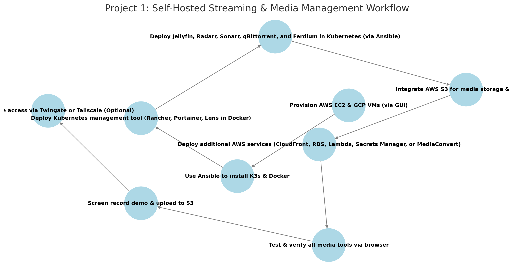

# AWS Project Thread 1: Multi-Cloud K3s Cluster for Secure Media & Collaboration  

## Scenario: Secure Multi-Cloud Infrastructure for a Remote Media & Collaboration Platform  

### Background  
Your company, **Global Edge Solutions (GES)**, is contracted by **Frontline Journalists Network (FJN)** to build a **secure, cloud-native infrastructure** that enables:  

- **Media Storage & Streaming** – Journalists can upload, store, and stream video reports.  
- **Private Communication** – Teams coordinate securely using encrypted messaging.  
- **Self-Hosted Knowledge Management** – Reporters and analysts store research and notes.  
- **Internal Version Control** – Developers maintain the platform with a private Git repository.
- **Unified Dashboard for Service Access** – Users need a single centralized interface to access all deployed services.  

FJN requires a **multi-cloud solution (AWS + GCP)** to **avoid vendor lock-in** and ensure **high availability**, with **automated deployments and cloud storage integration**.  

---

## Project Requirements  

### ✅ Deploy 4-5 Virtual Machines *(via AWS & GCP GUI)*  
- **3 in AWS** (EC2 instances)  
- **1-2 in GCP** (Compute Engine VMs)  

### ✅ Use Ansible to Automate  
- **Install K3s & Docker** on all nodes  
- **Deploy Kubernetes management tool** in Docker (Rancher, Portainer, or Lens)  
- **Deploy all services in K3s**  

### ✅ Deploy & Expose the Following Services *(Accessible via Browser)*  
- **Kubernetes Management Tool** *(Rancher, Portainer, or Lens in Docker)*  
- **Plex Media Server** *(NodePort, storing media in an S3 bucket)*  
- **Matrix/Synapse & Element** *(Encrypted messaging for secure communication)*  
- **Gitea** *(Self-hosted Git for internal development)*  
- **Obsidian** *(Self-hosted note-taking & knowledge management)*
- **Ferdium** (Integrated dashboard for centralizing access to all services)

### ✅ Integrate AWS Services *(Mandatory: EC2, S3, and one additional AWS tool)*  
- **EC2** – Deploy virtual machines for K3s cluster.  
- **S3** – Store media files and project demo recordings.  
- **Third AWS Tool (Choose One)**:  
  - **AWS RDS** – Managed database for services.  
  - **AWS CloudWatch** – Monitoring and logging.  
  - **AWS Secrets Manager** – Secure storage for credentials.
  - **any other tool**

### ✅ Upload & Access Demo Content  
- **Record a project demo/video** and upload to an **S3 bucket**.  
- **Ensure media is visible and playable in Plex**.  

### ✅ *(Optional)* Secure Remote Access with Twingate  
- **If required, implement Twingate for access control**.  

---

## Role of Each Tool  

### **AWS Services**  
- **EC2** – Host 3 virtual machines for the cluster.  
- **S3** – Persistent storage for Plex media and demo recordings.  
- **Third AWS Tool** – Adds **logging, security, or database functionality** (student’s choice).  

### **Ansible**  
- **Install K3s** on all nodes.  
- **Install Docker** on the machine hosting the Kubernetes management tool.  
- **Deploy Kubernetes management tool** in Docker (Rancher, Portainer, or Lens).  
- **Deploy all services** (Plex, Matrix/Synapse, Gitea, Obsidian, Ferdium ) in Kubernetes.  

### **Docker**  
- **Runs the Kubernetes management tool** *(Rancher, Portainer, or Lens) in a standalone container*.  

---

## Recommended Workflow  
## Workflow Diagram


```plaintext
1️⃣ Provision AWS EC2 & GCP VMs (via GUI)
2️⃣ Use Ansible to install K3s & Docker
3️⃣ Deploy Kubernetes management tool (Rancher, Portainer, Lens in Docker)
4️⃣ Deploy Plex, Matrix/Synapse, Gitea, Obsidian, Ferdium in Kubernetes (via Ansible)
5️⃣ Integrate AWS S3 for Plex media storage
6️⃣ Deploy additional AWS feature (RDS, CloudWatch, or Secrets Manager)
7️⃣ Test & verify all services via browser
8️⃣ Screen record demo & upload to S3
9️⃣ Secure remote access via Twingate (Optional)
