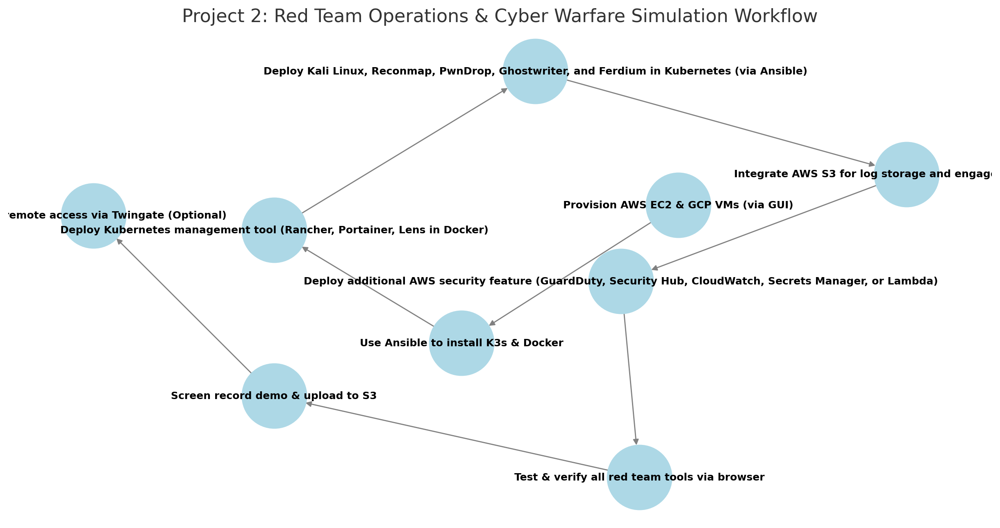

# **AWS Project Thread 2: Multi-Cloud K3s Cluster for Red Team Operations & Cyber Warfare Simulation**  

## **Background**  
The **U.S. military** requires **aggressive cybersecurity training and adversary simulation capabilities** to prepare for **cyber warfare, network exploitation, and red team engagements**. Cyber operations units must continuously **test, improve, and harden** Department of Defense (DoD) networks against **nation-state threats, advanced persistent threats (APTs), and insider risks**.  

To support these efforts, the **Unified Cyber Defense (UCD) task force** has commissioned **Cyber Sentinel Solutions (CSS)** to develop a **self-hosted, multi-cloud red team operations platform**. The system must enable **threat emulation, penetration testing, offensive security collaboration, and secure payload delivery** while ensuring **data sovereignty and OPSEC (Operational Security)**.  

This project will deploy **red team cybersecurity tools** within a **K3s-based Kubernetes cluster** spanning **AWS and GCP**, fully automated with **Ansible**, and integrating **AWS services for security, storage, monitoring, and adversary tracking**.  

---

### **Military Application**  
- Provides a **self-hosted red team cyber range** for **SOC teams and offensive cyber operators**.  
- Enables **adversary emulation and advanced penetration testing** on military networks.  
- Supports **secure payload delivery, engagement tracking, and vulnerability exploitation**.  
- Ensures **real-world offensive security exercises** can be executed in **classified or air-gapped environments**.  
- Helps **test military blue teams (defensive cyber operators) against real-world attack scenarios**.  

---

### **Technical Focus**  
- **Kali Linux** for **penetration testing, exploit development, and adversary emulation**.  
- **Reconmap** for **red team collaboration, pentest tracking, and vulnerability management**.  
- **PwnDrop** for **secure file transfer, payload hosting, and exploit delivery**.  
- **Ghostwriter** for **engagement tracking, adversary simulation reporting, and OPSEC analysis**.  
- **K3s-based Kubernetes cluster** deployed across **AWS and GCP** for redundancy.  
- **Ansible automation** for **installation, configuration, and orchestration**.  
- **AWS services** such as **S3 for log storage**, **CloudWatch for monitoring**, and **GuardDuty for adversary detection** can be integrated to enhance functionality.  

---

## **Project Requirements**  

### ✅ **Deploy 4-5 Virtual Machines** *(via AWS & GCP GUI)*  
- **3 in AWS** (EC2 instances)  
- **1-2 in GCP** (Compute Engine VMs)  

### ✅ **Use Ansible to Automate**  
- **Install K3s & Docker** on all nodes.  
- **Deploy Kubernetes management tool** *(Rancher, Portainer, or Lens - deployed via Ansible in a standalone Docker container.)*  
- **Deploy all red team cybersecurity tools in K3s**.  

### ✅ **Deploy & Expose the Following Offensive Security Services** *(Accessible via Browser)*  
- **Kubernetes Management Tool** *(Rancher, Portainer, or Lens - deployed via Ansible in a standalone Docker container)*.  
- **Kali Linux** *(Red team penetration testing and offensive security toolkit in Kubernetes.)*  
- **Reconmap** *(Self-hosted pentesting platform for vulnerability management & red team collaboration.)*  
- **PwnDrop** *(Secure payload hosting and exploit delivery for red team engagements.)*  
- **Ghostwriter** *(Red team engagement tracking, OPSEC analysis, and reporting platform.)*  
- **Ferdium** *(Integrated dashboard for centralized access to all red team tools.)*  

### ✅ **Integrate AWS Services (Total: 5)**  
- **Mandatory AWS Services:**  
  - **EC2** – Deploy virtual machines for the red team operations cluster.  
  - **S3** – Secure storage for logs, payloads, and engagement reports.  

- **Choose 3 Additional AWS Services from the Following:**  
  - **AWS GuardDuty** – Automated **threat detection and adversary tracking**.  
  - **AWS Security Hub** – **Centralized security intelligence & compliance insights**.  
  - **AWS CloudWatch** – **Real-time monitoring of attack traffic and system logs**.  
  - **AWS Secrets Manager** – **Secure storage of SOC credentials and API keys**.  
  - **AWS Lambda** – **Automated security event processing and attack chain analysis**.  

---

### ✅ **Upload & Access Demo Content**  
- **Record a project demo/video** and upload to an **S3 bucket**.  
- **Ensure all engagement reports, payloads, and attack logs are functional**.  

### ✅ *(Optional)* Secure Remote Access with Twingate  
- **If required, implement Twingate for secure external access to red team operations**.  

---

## **Role of Each Tool**  

### **AWS Services**  
- **EC2** – Hosts 3 virtual machines for the red team operations cluster.  
- **S3** – Stores red team logs, payloads, and reports.  
- **GuardDuty (Optional)** – Provides **adversary tracking and threat detection**.  
- **Security Hub (Optional)** – Centralized compliance and intelligence for cyber operations.  
- **CloudWatch (Optional)** – Monitors logs and attack activity in real-time.  
- **Secrets Manager (Optional)** – Securely manages **red team credentials & API keys**.  
- **Lambda (Optional)** – Automates **attack analysis and engagement reporting**.  

---

### **Ansible**  
- **Install K3s** on all nodes.  
- **Install Docker** on the machine hosting the Kubernetes management tool.  
- **Deploy Kubernetes management tool** *(Rancher, Portainer, or Lens in a standalone Docker container.)*  
- **Deploy all red team cybersecurity tools** *(Kali Linux, Reconmap, PwnDrop, Ghostwriter, Ferdium) in Kubernetes.*  

---

### **Docker**  
- **Runs the Kubernetes management tool** *(Rancher, Portainer, or Lens) in a standalone container*.  

---

### **Offensive Security Tools**  
- **Kali Linux** *(Full penetration testing environment deployed in Kubernetes.)*  
- **Reconmap** *(Red team collaboration, pentest tracking, vulnerability management.)*  
- **PwnDrop** *(Secure file transfer, payload hosting, exploit delivery for red team ops.)*  
- **Ghostwriter** *(Engagement tracking, adversary reporting, OPSEC analysis for red teams.)*  
- **Ferdium** *(Unified dashboard to manage all offensive security tools.)*  

---

## **Recommended Workflow**  

```plaintext
1️⃣ Provision AWS EC2 & GCP VMs (via GUI)
2️⃣ Use Ansible to install K3s & Docker
3️⃣ Deploy Kubernetes management tool (Rancher, Portainer, Lens in Docker)
4️⃣ Deploy Kali Linux, Reconmap, PwnDrop, Ghostwriter, and Ferdium in Kubernetes (via Ansible)
5️⃣ Integrate AWS S3 for log storage and engagement tracking
6️⃣ Deploy additional AWS security feature (GuardDuty, Security Hub, CloudWatch, Secrets Manager, or Lambda)
7️⃣ Test & verify all red team tools via browser
8️⃣ Screen record demo & upload to S3
9️⃣ Secure remote access via Twingate (Optional)
```

## Recommended Workflow  


