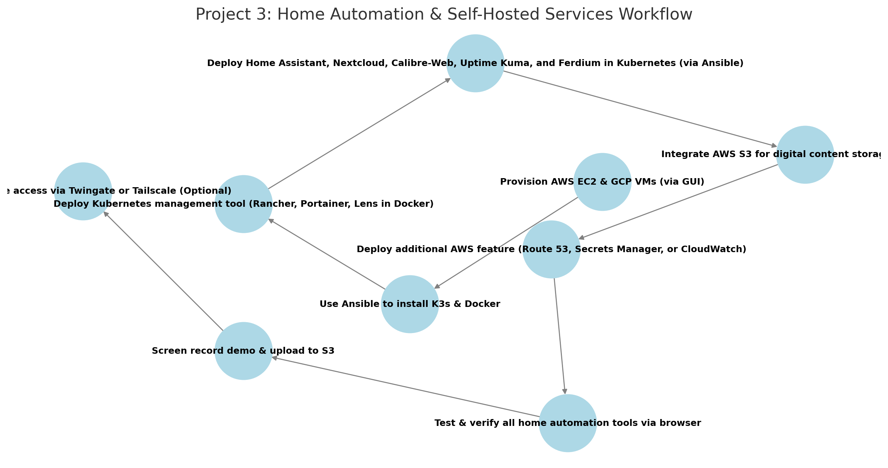

# AWS Project Thread 3: Multi-Cloud K3s Cluster for Home Automation & Self-Hosted Services  

## Scenario: Smart Home & Private Cloud Infrastructure  

## **Background**  
Modern military housing and field operations require **secure, locally managed automation and self-hosted services** that do not rely on external cloud providers. Whether deployed in **remote environments** or in base housing, service members need **network security, file sharing, media access, and device automation** that work regardless of internet availability.  

To address these needs, the **Unified Cyber Defense (UCD) task force** has contracted **Cyber Sentinel Solutions (CSS)** to develop a **self-hosted home automation and service platform** that ensures **local control over smart devices, network security, and seamless file sharing** without relying on commercial cloud solutions.  

This solution will be deployed across **AWS and GCP** using **K3s for lightweight container orchestration**, fully automated with **Ansible**, and integrated with **AWS services for security, backup, and automation**.  

---

### **Military Application**  
- Provides **local home automation and self-hosted services** without external cloud dependencies.  
- Ensures **secure network-wide ad-blocking and content filtering**.  
- Enables **peer-to-peer file sharing without requiring external servers**.  
- Supports **data redundancy and local storage access** for service members in remote environments.  
- Improves **unit-level IT resilience by reducing reliance on internet-based services**.  

---

### **Technical Focus**  
- **Kubernetes Management Tool** provides **cluster monitoring, service orchestration, and deployment control**.  
- **Home Assistant** manages **local automation, smart devices, and IoT integration**.  
- **Nextcloud** offers **self-hosted file storage, sync, and document collaboration**.  
- **PairDrop** enables **secure, peer-to-peer file sharing over local networks**.  
- **AdGuard Home** provides **network-wide ad-blocking, tracker filtering, and DNS-based content control**.  
- **Ferdium** integrates all services into a **single, unified dashboard** for ease of access.  
- **K3s-based Kubernetes cluster** deployed across **AWS and GCP** for redundancy.  
- **Ansible automation** for **streamlined installation and configuration**.  
- **AWS services** such as **S3 for backups, IoT Core for automation, and CloudWatch for monitoring** can be integrated to enhance functionality.  

---

## Project Requirements  

### ✅ Deploy 4-5 Virtual Machines *(via AWS & GCP GUI)*  
- **3 in AWS** (EC2 instances)  
- **1-2 in GCP** (Compute Engine VMs)  

### ✅ Use Ansible to Automate  
- **Install K3s & Docker** on all nodes.  
- **Deploy Kubernetes management tool** *(Rancher, Portainer, or Lens - deployed via Ansible in a standalone Docker container.)*  
- **Deploy all home automation and homelab services in K3s**.  

### ✅ **Deploy & Expose the Following Self-Hosted Services** *(Accessible via Browser & Local Network Devices)*  
- **Kubernetes Management Tool** *(Rancher, Portainer, or Lens - deployed via Ansible in a standalone Docker container.)*  
- **Home Assistant** *(Self-hosted smart home automation platform.)*  
- **Nextcloud** *(Secure, private file storage and sync solution.)*  
- **PairDrop** *(Local, encrypted, peer-to-peer file sharing.)*  
- **AdGuard Home** *(Network-wide ad-blocking, DNS filtering, and content control.)*  
- **Ferdium** *(Unified dashboard for managing all self-hosted services.)*  

### ✅ **Integrate AWS Services (Total: 5)**  
- **Mandatory AWS Services:**  
  - **EC2** – Hosts the home automation & self-hosted services cluster.  
  - **S3** – Stores backups, configuration files, and demo recordings.  

- **Select 3 additional AWS services to enhance your project. Below are 5 recommended options:**  
  - **AWS IoT Core** – Connects and manages smart devices securely in the cloud.  
  - **AWS Lambda** – Automates routine tasks such as data processing and notifications.  
  - **AWS CloudFront** – Caches and accelerates content delivery for remote access.  
  - **AWS Secrets Manager** – Securely stores API keys and access credentials.  
  - **AWS CloudWatch** – Monitors uptime, resource utilization, and service health. 

### ✅ Upload & Access Demo Content  
- **Record a project demo/video** and upload to an **S3 bucket**.  
- **Ensure all self-hosted services are accessible via web browser and local network devices.**  

### ✅ *(Optional)* Secure Remote Access with Twingate or Tailscale  
- **If required, implement Twingate for secure external access to home automation and file sharing services**.  

---

## Role of Each Tool  

### **AWS Services**  
- **EC2** – Hosts 3 virtual machines for the home automation & self-hosted services cluster.  
- **S3** – Stores backups, configuration files, and demo recordings.  
- **IoT Core (Optional)** – Securely connects and manages smart home devices.  
- **Lambda (Optional)** – Automates **home automation triggers and notifications**.  
- **CloudFront (Optional)** – **Speeds up access to self-hosted services remotely**.  
- **Secrets Manager (Optional)** – **Secures API keys for home automation and file storage**.  
- **CloudWatch (Optional)** – **Monitors uptime and system performance**.  

---

### **Ansible**  
- **Install K3s** on all nodes.  
- **Install Docker** on the machine hosting the Kubernetes management tool.  
- **Deploy Kubernetes management tool** *(Rancher, Portainer, or Lens in a standalone Docker container.)*  
- **Deploy all home automation and self-hosted services** *(Home Assistant, Nextcloud, PairDrop, AdGuard Home, Ferdium) in Kubernetes.*  

---

### **Docker**  
- **Runs the Kubernetes management tool** *(Rancher, Portainer, or Lens) in a standalone container*.  

---

### **Self-Hosted Services**  
- **Home Assistant** *(Smart home automation platform, integrates IoT devices.)*  
- **Nextcloud** *(Private cloud storage and file sync, alternative to Google Drive.)*  
- **PairDrop** *(Encrypted, peer-to-peer file sharing over local networks.)*  
- **AdGuard Home** *(DNS-based ad-blocking, tracker filtering, and content control.)*  
- **Ferdium** *(Unified dashboard for managing all self-hosted services.)*  

---

## **Recommended Workflow**  

```plaintext
1️⃣ Provision AWS EC2 & GCP VMs (via GUI)
2️⃣ Use Ansible to install K3s & Docker on all nodes
3️⃣ Deploy the Kubernetes management tool (Rancher, Portainer, or Lens) in a standalone Docker container via Ansible
4️⃣ Deploy Home Assistant, Nextcloud, PairDrop, AdGuard Home, and Ferdium in Kubernetes using linuxserver.io container images
5️⃣ Integrate AWS S3 for backups, configuration storage, and demo recordings
6️⃣ Deploy mandatory AWS services (EC2, S3) and select 3 additional AWS services (e.g., IoT Core, Lambda, CloudFront)
7️⃣ Test and verify service accessibility via web browser and local network devices
8️⃣ Record a project demo/video and upload it to S3
9️⃣ Optionally, secure remote access with Twingate or Tailscale
```

## Recommended Workflow  

