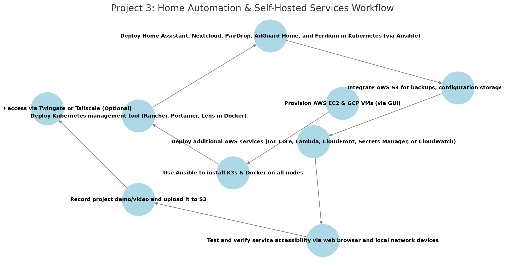

# AWS Project Thread 3: Multi-Cloud K3s Cluster for Home Automation & Self-Hosted Services  

## Scenario: Smart Home & Private Cloud Infrastructure  

### Background  
Your company, **HomeCloud Solutions (HCS)**, is developing a **self-hosted, multi-cloud home automation and private cloud platform** for **tech enthusiasts and homelab users**. This solution must:  

- **Enable Home Automation** – Deploy a **self-hosted home automation platform** to control smart devices.  
- **Securely Store & Share Personal Files** – Provide a **private cloud storage solution** for documents and personal media.  
- **Manage & Stream Digital Content** – Deploy a **self-hosted digital library** for books, audiobooks, and personal archives.  
- **Enhance Home Security** – Implement **self-hosted security monitoring and logging** for network and IoT devices.  
- **Provide a Unified Dashboard** – Centralize access to all home services in a **single web interface**.  
- **Ensure Remote Access** – Allow secure access to home services from outside the local network.  

HCS requires this **home automation and homelab infrastructure** to be **distributed across AWS and GCP** for redundancy, **self-hosted for data privacy**, and **fully automated with Ansible** for easy deployment.  

---

## Project Requirements  

### ✅ Deploy 4-5 Virtual Machines *(via AWS & GCP GUI)*  
- **3 in AWS** (EC2 instances)  
- **1-2 in GCP** (Compute Engine VMs)  

### ✅ Use Ansible to Automate  
- **Install K3s & Docker** on all nodes.  
- **Deploy Kubernetes management tool** in Docker (Rancher, Portainer, or Lens).  
- **Deploy all home automation and homelab services in K3s**.  

### ✅ Deploy & Expose the Following Services *(Accessible via Browser)*  
- **Kubernetes Management Tool** *(Rancher, Portainer, or Lens in Docker)*.  
- **Home Assistant** *(Centralized smart home automation platform for IoT devices)*.  
- **Nextcloud** *(Self-hosted personal cloud storage & file sharing solution)*.  
- **Calibre-Web** *(Self-hosted digital library for eBooks and audiobooks)*.  
- **Uptime Kuma** *(Monitor the status of home network and services with uptime alerts)*.  
- **Ferdium** *(Integrated dashboard for centralizing access to all services)*.  

### ✅ Integrate AWS Services *(Mandatory: EC2, S3, and one additional AWS tool)*  
- **EC2** – Deploy virtual machines for the home automation cluster.  
- **S3** – Store backups, eBooks, audiobooks, and home automation configurations.  
- **Third AWS Tool (Choose One)**:  
  - **AWS Route 53** – Custom domain & DNS management for remote access.  
  - **AWS Secrets Manager** – Secure storage for API keys & credentials.  
  - **AWS CloudWatch** – Monitoring & logging for smart home devices.  

### ✅ Upload & Access Demo Content  
- **Record a project demo/video** and upload to an **S3 bucket**.  
- **Ensure books & audiobooks are available in Calibre-Web**.  

### ✅ *(Optional)* Secure Remote Access with Twingate or Tailscale  
- **If required, implement Twingate or Tailscale for secure external access to home services**.  

---

## Role of Each Tool  

### **AWS Services**  
- **EC2** – Hosts 3 virtual machines for the home automation cluster.  
- **S3** – Stores backups, eBooks, audiobooks, and home automation configuration files.  
- **Third AWS Tool** – Adds **DNS, security, or monitoring functionality** (student’s choice).  

### **Ansible**  
- **Install K3s** on all nodes.  
- **Install Docker** on the machine hosting the Kubernetes management tool.  
- **Deploy Kubernetes management tool** in Docker (Rancher, Portainer, or Lens).  
- **Deploy all home automation tools** (Home Assistant, Nextcloud, Calibre-Web, Uptime Kuma, Ferdium) in Kubernetes.  

### **Docker**  
- **Runs the Kubernetes management tool** *(Rancher, Portainer, or Lens) in a standalone container*.  

### **Calibre-Web (Self-Hosted Digital Library)**  
- **Provides an organized digital library for books & audiobooks**.  
- **Accessible via web browser for reading & streaming audiobooks**.  
- **Allows home users to manage and curate their personal book collection**.  

### **Ferdium (Home Automation Dashboard)**  
- **Aggregates all home-related services** into a single interface.  
- **Provides centralized access for home automation, media, security, and monitoring tools**.  

---

## Recommended Workflow  

```plaintext
1️⃣ Provision AWS EC2 & GCP VMs (via GUI)
2️⃣ Use Ansible to install K3s & Docker
3️⃣ Deploy Kubernetes management tool (Rancher, Portainer, Lens in Docker)
4️⃣ Deploy Home Assistant, Nextcloud, Calibre-Web, Uptime Kuma, and Ferdium in Kubernetes (via Ansible)
5️⃣ Integrate AWS S3 for digital content storage & backups
6️⃣ Deploy additional AWS feature (Route 53, Secrets Manager, or CloudWatch)
7️⃣ Test & verify all home automation tools via browser
8️⃣ Screen record demo & upload to S3
9️⃣ Secure remote access via Twingate or Tailscale (Optional)
