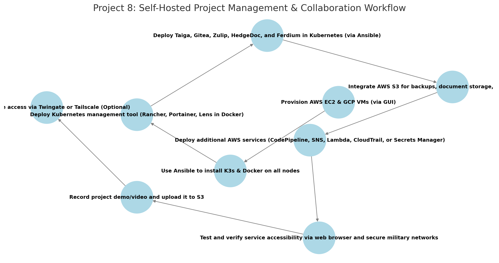

# **AWS Project Thread 8: Self-Hosted Project Management & Collaboration Platform for Military Operations**  

## **Background**  
Military operations require **secure, self-hosted collaboration tools** for **mission planning, coordination, and execution** in environments where **internet access may be restricted, compromised, or unavailable**. Existing cloud-based solutions such as **Jira, Slack, and Google Docs** pose security risks and may be **inaccessible in contested or air-gapped environments**.  

To address these challenges, the **Unified Cyber Defense (UCD) task force** has commissioned **Cyber Sentinel Solutions (CSS)** to develop a **self-hosted, multi-cloud project management and collaboration platform** that ensures **secure communication, real-time documentation, and operational continuity** across military teams.  

This solution will be deployed across **AWS and GCP** using **K3s for lightweight container orchestration**, fully automated with **Ansible**, and integrated with **AWS services for security, backup, and automation**.  

---

### **Military Application**  
- Provides a **self-hosted project management platform** for mission planning and coordination.  
- Enables **secure team collaboration** without relying on external networks.  
- Supports **structured task tracking and issue management** for operational efficiency.  
- Ensures **real-time document collaboration** for mission reports and intelligence briefings.  
- Enhances **operational security** by keeping all project data within **private military infrastructure**.  

---

### **Technical Focus**  
- **Kubernetes Management Tool** provides **cluster monitoring, service orchestration, and deployment control**.  
- **Taiga** serves as the **primary self-hosted project management system** for agile workflows.  
- **Gitea** offers a **self-hosted Git repository for version control and document storage**.  
- **Zulip** enables **structured, encrypted team messaging and mission coordination**.  
- **HedgeDoc** facilitates **real-time collaborative markdown-based documentation**.  
- **Ferdium** integrates all tools into a **single, unified dashboard** for accessibility.  
- **K3s-based Kubernetes cluster** deployed across **AWS and GCP** for redundancy.  
- **Ansible automation** for **streamlined installation and configuration**.  
- **AWS services** such as **S3 for backups, SNS for alerts, and Lambda for automation** can be integrated to enhance functionality.  

---

## **Project Requirements**  

### ✅ **Deploy 4-5 Virtual Machines** *(via AWS & GCP GUI)*  
- **3 in AWS** (EC2 instances)  
- **1-2 in GCP** (Compute Engine VMs)  

### ✅ **Use Ansible to Automate**  
- **Install K3s & Docker** on all nodes.  
- **Deploy Kubernetes management tool** *(Rancher, Portainer, or Lens - deployed via Ansible in a standalone Docker container.)*  
- **Deploy all project management tools in K3s**.  

### ✅ **Deploy & Expose the Following Project Management Services** *(Accessible via Browser)*  
- **Kubernetes Management Tool** *(Rancher, Portainer, or Lens - deployed via Ansible in a standalone Docker container.)*  
- **Taiga** *(Self-hosted agile project management & issue tracking system.)*  
- **Gitea** *(Self-hosted Git repository for version control and documentation storage.)*  
- **Zulip** *(Secure, structured, real-time messaging platform for operational collaboration.)*  
- **HedgeDoc** *(Real-time markdown-based collaborative documentation platform.)*  
- **Ferdium** *(Unified dashboard for centralized access to all tools.)*  

### ✅ **Integrate AWS Services (Total: 5)**  
- **Mandatory AWS Services:**  
  - **EC2** – Deploy virtual machines for the project management cluster.  
  - **S3** – Secure storage for project backups, documents, and demo recordings.  

- **Choose 3 Additional AWS Services from the Following:**  
  - **AWS CodePipeline** – Automates **CI/CD for project updates**.  
  - **AWS SNS** – Sends **real-time alerts** for operational events.  
  - **AWS Lambda** – Automates **routine tasks** like status updates.  
  - **AWS CloudTrail** – Monitors **account activity for compliance**.  
  - **AWS Secrets Manager** – Securely stores **project credentials and API keys**.  

### ✅ **Upload & Access Demo Content**  
- **Record a project demo/video** and upload to an **S3 bucket**.  
- **Ensure all project management services are accessible via web browser.**  

### ✅ *(Optional)* Secure Remote Access with Twingate or Tailscale  
- **If required, implement Twingate for secure external access to project management tools**.  

---

## **Role of Each Tool**  

### **AWS Services**  
- **EC2** – Hosts 3 virtual machines for the project management cluster.  
- **S3** – Stores project backups, documents, and demo recordings.  
- **CodePipeline (Optional)** – Automates **CI/CD pipeline** for updates.  
- **SNS (Optional)** – Sends **real-time alerts** for project status updates.  
- **Lambda (Optional)** – Automates **recurring project tasks**.  
- **CloudTrail (Optional)** – Tracks **system activity for security compliance**.  
- **Secrets Manager (Optional)** – **Secure storage for sensitive project credentials**.  

---

### **Ansible**  
- **Install K3s** on all nodes.  
- **Install Docker** on the machine hosting the Kubernetes management tool.  
- **Deploy Kubernetes management tool** *(Rancher, Portainer, or Lens in a standalone Docker container.)*  
- **Deploy all project management tools** *(Taiga, Gitea, Zulip, HedgeDoc, Ferdium) in Kubernetes.*  

---

### **Docker**  
- **Runs the Kubernetes management tool** *(Rancher, Portainer, or Lens) in a standalone container*.  

---

### **Collaboration & Project Management Tools**  
- **Taiga** *(Self-hosted project management & task tracking system.)*  
- **Gitea** *(Self-hosted Git repository & document storage for military operations.)*  
- **Zulip** *(Encrypted team communication platform for operational coordination.)*  
- **HedgeDoc** *(Real-time collaborative markdown-based documentation platform.)*  
- **Ferdium** *(Unified dashboard to manage all collaboration tools in a single interface.)*  

---

## **Recommended Workflow**  

```plaintext
1️⃣ Provision AWS EC2 & GCP VMs (via GUI)
2️⃣ Use Ansible to install K3s & Docker on all nodes
3️⃣ Deploy the Kubernetes management tool (Rancher, Portainer, or Lens) in a standalone Docker container via Ansible
4️⃣ Deploy Taiga, Gitea, Zulip, HedgeDoc, and Ferdium in Kubernetes using linuxserver.io container images
5️⃣ Integrate AWS S3 for backups, document storage, and demo recordings
6️⃣ Deploy mandatory AWS services (EC2, S3) and select 3 additional AWS services (e.g., CodePipeline, SNS, Lambda)
7️⃣ Test and verify service accessibility via web browser and secure military networks
8️⃣ Record a project demo/video and upload it to S3
9️⃣ Optionally, secure remote access with Twingate or Tailscale

```

## Workflow Diagram

