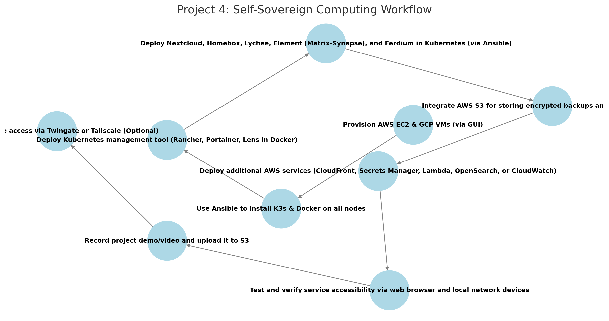

# **AWS Project Thread 4: Self-Sovereign Computing – Detaching from Big Tech & Society**  

## **📜 Background**  

Modern military operations require **secure, self-hosted alternatives to cloud-based services** to ensure **data ownership, privacy, and operational security**. Service members deployed in **remote locations, special operations units, and classified environments** need **self-sovereign computing solutions** that do not rely on **big tech companies, external cloud providers, or subscription-based services**.  

Military units often collect **intelligence reports, reconnaissance photos, and mission-critical files** that cannot be stored in **Google Drive, OneDrive, or AWS S3** due to **security classification and OPSEC risks**. Additionally, off-grid teams require **a self-hosted communication system** to replace commercial services like **WhatsApp, Slack, and Zoom**.  

To address these challenges, the **Unified Cyber Defense (UCD) task force** has commissioned **Cyber Sentinel Solutions (CSS)** to develop a **self-sovereign computing environment** that allows **complete digital independence** while maintaining **secure storage, encrypted communication, and operational control over critical assets**.  

This solution will be deployed across **AWS and GCP** (for project scale testing), using **K3s for lightweight container orchestration**, fully automated with **Ansible**, and integrated with **privacy-focused and decentralized alternatives**.  

---

## **📌 Military & Self-Sovereign Computing Application**  
- Provides a **self-hosted, privacy-focused alternative** to big tech services.  
- Ensures **full control over classified and mission-critical data** without third-party oversight.  
- Enables **secure file storage, communication, and digital asset management** in an **independent, private cloud**.  
- Supports **off-grid, decentralized computing** for **mission continuity, operational security, and digital minimalism**.  
- **Reduces reliance on Google, Microsoft, Apple, and Amazon services** while maintaining full digital capabilities.  

---

## **⚙️ Technical Focus**  
- **Kubernetes Management Tool** provides **cluster monitoring, service orchestration, and deployment control**.  
- **Nextcloud** serves as a **self-hosted cloud alternative for secure file storage, document editing, and military collaboration**.  
- **Homebox** offers **self-hosted inventory & asset management for mission gear, equipment, and logistics tracking**.  
- **Lychee** provides a **self-hosted photo archive for storing reconnaissance images, drone footage, and mission photography**.  
- **Element (Matrix-Synapse)** enables **decentralized, encrypted messaging** for **unit communication without reliance on commercial apps**.  
- **Ferdium** integrates all services into a **single, unified dashboard** for mission control.  
- **K3s-based Kubernetes cluster** deployed across **AWS and GCP** for redundancy.  
- **Ansible automation** for **streamlined installation and configuration**.  
- **AWS services** such as **S3 for private backups, CloudFront for decentralized content delivery, and Secrets Manager for encrypted credential storage** can be integrated to enhance functionality.  

---

## **📌 Project Requirements**  

### ✅ **Deploy 4-5 Virtual Machines** *(via AWS & GCP GUI)*  
- **3 in AWS** (EC2 instances)  
- **1-2 in GCP** (Compute Engine VMs)  

### ✅ **Use Ansible to Automate**  
- **Install K3s & Docker** on all nodes.  
- **Deploy Kubernetes management tool** *(Rancher, Portainer, or Lens - deployed via Ansible in a standalone Docker container.)*  
- **Deploy all self-sovereign services in K3s**.  

### ✅ **Deploy & Expose the Following Self-Hosted Services** *(Accessible via Browser & Local Network Devices)*  
- **Kubernetes Management Tool** *(Rancher, Portainer, or Lens - deployed via Ansible in a standalone Docker container.)*  
- **Nextcloud** *(Self-hosted file storage, military documentation, and collaborative tools.)*  
- **Homebox** *(Self-hosted inventory & asset manager for organizing mission gear and logistics.)*  
- **Lychee** *(Self-hosted photo library for reconnaissance images, drone footage, and operational photos.)*  
- **Element (Matrix-Synapse)** *(Decentralized, encrypted messaging for secure unit communication.)*  
- **Ferdium** *(Unified dashboard for mission control and quick access to all services.)*  

### ✅ **Integrate AWS Services (Total: 5)**  
- **Mandatory AWS Services:**  
  - **EC2** – Hosts the self-sovereign computing environment.  
  - **S3** – Stores encrypted backups, classified documents, and OPSEC-relevant data.  

- **Select 3 additional AWS services to enhance your project. Below are 5 recommended options:**  
  - **AWS CloudFront** – Caches and accelerates content delivery for global accessibility.  
  - **AWS Secrets Manager** – Securely stores encryption keys and credentials.  
  - **AWS Lambda** – Automates privacy-focused tasks such as secure backups and self-destructing files.  
  - **AWS OpenSearch (Optional)** – Self-hosted, open-source search engine for mission-critical documents and reports.  
  - **AWS CloudWatch** – Monitors system health and uptime while maintaining full control over logs.  


### ✅ **Upload & Access Demo Content**  
- **Record a project demo/video** and upload to an **S3 bucket**.  
- **Ensure all privacy-focused self-hosted services are accessible via web browser and local network devices.**  

### ✅ *(Optional)* Secure Remote Access with Twingate or Tailscale  
- **If required, implement Twingate for secure external access to self-hosted services.**  

---

## **🛠 Role of Each Tool**  

### **AWS Services**  
- **EC2** – Hosts 3 virtual machines for the self-sovereign computing environment.  
- **S3** – Stores encrypted backups, reconnaissance images, and mission-critical data.  
- **CloudFront (Optional)** – **Decentralized, privacy-preserving content acceleration**.  
- **Secrets Manager (Optional)** – **Secure storage for encryption keys and credentials**.  
- **Lambda (Optional)** – **Automates privacy-related self-hosting tasks**.  
- **OpenSearch (Optional)** – **Self-hosted search for locally stored files and documents**.  
- **CloudWatch (Optional)** – **Logs and monitors self-hosted services without third-party analytics**.  

---

### **Ansible**  
- **Install K3s** on all nodes.  
- **Install Docker** on the machine hosting the Kubernetes management tool.  
- **Deploy Kubernetes management tool** *(Rancher, Portainer, or Lens in a standalone Docker container.)*  
- **Deploy all self-sovereign computing services** *(Nextcloud, Homebox, Lychee, Element, Ferdium) in Kubernetes.*  

---

## **📌 Recommended Workflow**  

```plaintext
1️⃣ Provision AWS EC2 & GCP VMs (via GUI)
2️⃣ Use Ansible to install K3s & Docker on all nodes
3️⃣ Deploy the Kubernetes management tool (Rancher, Portainer, or Lens) in a standalone Docker container via Ansible
4️⃣ Deploy Nextcloud, Homebox, Lychee, Element (Matrix-Synapse), and Ferdium in Kubernetes using linuxserver.io container images
5️⃣ Integrate AWS S3 for storing encrypted backups and mission-critical data
6️⃣ Deploy mandatory AWS services (EC2, S3) and select 3 additional AWS services (e.g., CloudFront, Secrets Manager, Lambda)
7️⃣ Test and verify service accessibility via web browser and local network devices
8️⃣ Record a project demo/video and upload it to S3
9️⃣ Optionally, secure remote access with Twingate or Tailscale
```
## Workflow Diagram

