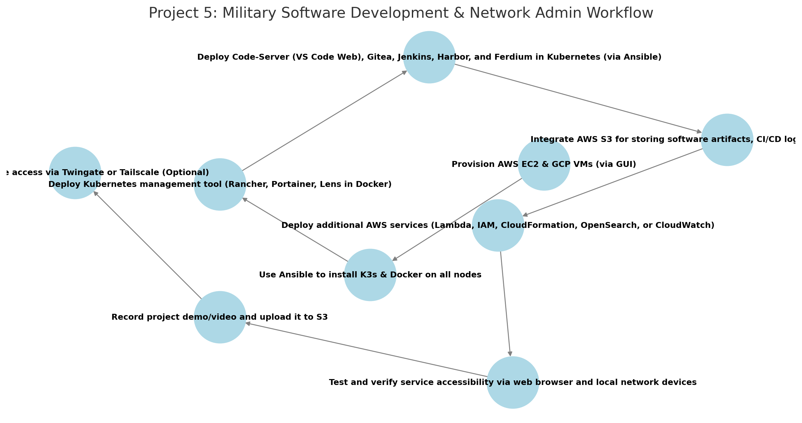

# **AWS Project Thread 5: Military Software Development & Network Administration Lab**  

## **📜 Background**  

Modern military operations increasingly rely on **custom software development, automation, and secure network administration**. The **Army Software Factory (ASF)** and similar initiatives have demonstrated the importance of **in-house military software development** to improve **mission effectiveness, reduce reliance on civilian contractors, and enhance cybersecurity**.  

Military software developers and network administrators require a **self-hosted, cloud-agnostic development and training environment** to **build, test, and deploy applications while managing secure military networks**. This environment must integrate **IDE platforms, CI/CD pipelines, containerization tools, and infrastructure automation** to prepare personnel for **real-world military DevOps roles**.  

To address this, the **Unified Cyber Defense (UCD) task force** has commissioned **Cyber Sentinel Solutions (CSS)** to develop a **self-hosted military software development and network administration lab** that serves as both a **learning environment** and a **fully functional DevSecOps development platform**.  

This solution will be deployed across **AWS and GCP** (for scale testing), using **K3s for lightweight container orchestration**, fully automated with **Ansible**, and integrated with **military-relevant developer tools**.  

---

## **📌 Military & DevOps Application**  
- Provides a **self-hosted, military software development environment** for mission-focused application development.  
- Serves as a **training ground for military DevSecOps engineers and network administrators**.  
- Ensures **secure, on-premises application development, testing, and deployment** without reliance on commercial cloud providers.  
- Enables **self-hosted CI/CD pipelines, DevOps tools, and infrastructure automation** for military networks.  
- Supports **off-grid, military DevSecOps operations** while remaining scalable for global collaboration.  

---

## **⚙️ Technical Focus**  
- **Kubernetes Management Tool** provides **cluster monitoring, service orchestration, and deployment control**.  
- **Code-Server (VS Code Web)** serves as a **self-hosted web-based IDE for military software development**.  
- **Gitea** provides a **self-hosted, lightweight Git service** for military source code management.  
- **Jenkins** offers a **self-hosted CI/CD pipeline** for **automated software builds, testing, and deployment**.  
- **Harbor** enables **self-hosted container registry management** with **security scanning and artifact storage**.  
- **Ferdium** integrates all tools into a **single, unified dashboard**.  
- **K3s-based Kubernetes cluster** deployed across **AWS and GCP** for redundancy.  
- **Ansible automation** for **streamlined installation and configuration**.  
- **AWS services** such as **S3 for artifact storage, Lambda for automation, and IAM for secure access control** can be integrated to enhance functionality.  

---

## **📌 Project Requirements**  

### ✅ **Deploy 4-5 Virtual Machines** *(via AWS & GCP GUI)*  
- **3 in AWS** (EC2 instances)  
- **1-2 in GCP** (Compute Engine VMs)  

### ✅ **Use Ansible to Automate**  
- **Install K3s & Docker** on all nodes.  
- **Deploy Kubernetes management tool** *(Rancher, Portainer, or Lens - deployed via Ansible in a standalone Docker container.)*  
- **Deploy all military development tools in K3s**.  

### ✅ **Deploy & Expose the Following DevOps & Network Administration Tools** *(Accessible via Browser & Local Network Devices)*  
- **Kubernetes Management Tool** *(Rancher, Portainer, or Lens - deployed via Ansible in a standalone Docker container.)*  
- **Code-Server (VS Code Web)** *(Self-hosted IDE for military DevSecOps software development.)*  
- **Gitea** *(Self-hosted Git repository for version-controlled military applications.)*  
- **Jenkins** *(Self-hosted CI/CD pipeline for automated software deployment.)*  
- **Harbor** *(Self-hosted container registry with vulnerability scanning & artifact management.)*  
- **Ferdium** *(Unified dashboard for managing development and network tools.)*  

### ✅ **Integrate AWS Services (Total: 5)**  
- **Mandatory AWS Services:**  
  - **EC2** – Hosts the military software development lab.  
  - **S3** – Stores software artifacts, build logs, and CI/CD pipeline outputs.  

- **Select 3 additional AWS services to enhance your project. Below are 5 recommended options:**  
  - **AWS Lambda** – Automates deployment scripts and infrastructure provisioning.  
  - **AWS IAM** – Provides secure access control and military-grade authentication.  
  - **AWS CloudFormation** – Automates military infrastructure-as-code (IaC) deployments.  
  - **AWS OpenSearch (Optional)** – Self-hosted log aggregation for monitoring software builds and deployments.  
  - **AWS CloudWatch** – Monitors system health, application logs, and network security.  


### ✅ **Upload & Access Demo Content**  
- **Record a project demo/video** and upload to an **S3 bucket**.  
- **Ensure all self-hosted DevOps and network administration tools are accessible via web browser and local network devices.**  

### ✅ *(Optional)* Secure Remote Access with Twingate or Tailscale  
- **If required, implement Twingate for secure external access to self-hosted services.**  

---

## **🛠 Role of Each Tool**  

### **AWS Services**  
- **EC2** – Hosts 3 virtual machines for the military DevOps & network lab.  
- **S3** – Stores software artifacts, CI/CD logs, and infrastructure backups.  
- **Lambda (Optional)** – **Automates DevOps tasks such as application deployment and server provisioning**.  
- **IAM (Optional)** – **Implements role-based access control for developers and network engineers**.  
- **CloudFormation (Optional)** – **Automates infrastructure deployment and configuration management**.  
- **OpenSearch (Optional)** – **Aggregates logs for CI/CD pipeline visibility**.  
- **CloudWatch (Optional)** – **Monitors application health and security logs**.  

---

### **Ansible**  
- **Install K3s** on all nodes.  
- **Install Docker** on the machine hosting the Kubernetes management tool.  
- **Deploy Kubernetes management tool** *(Rancher, Portainer, or Lens in a standalone Docker container.)*  
- **Deploy all military DevOps & network administration tools** *(Code-Server, Gitea, Jenkins, Harbor, Ferdium) in Kubernetes.*  

---

## **📌 Recommended Workflow**  

```plaintext
1️⃣ Provision AWS EC2 & GCP VMs (via GUI)
2️⃣ Use Ansible to install K3s & Docker on all nodes
3️⃣ Deploy the Kubernetes management tool (Rancher, Portainer, or Lens) in a standalone Docker container via Ansible
4️⃣ Deploy Code-Server (VS Code Web), Gitea, Jenkins, Harbor, and Ferdium in Kubernetes using linuxserver.io container images
5️⃣ Integrate AWS S3 for storing software artifacts, CI/CD logs, and deployment outputs
6️⃣ Deploy mandatory AWS services (EC2, S3) and select 3 additional AWS services (e.g., Lambda, IAM, CloudFormation)
7️⃣ Test and verify service accessibility via web browser and local network devices
8️⃣ Record a project demo/video and upload it to S3
9️⃣ Optionally, secure remote access with Twingate or Tailscale
```

## Workflow Diagram

