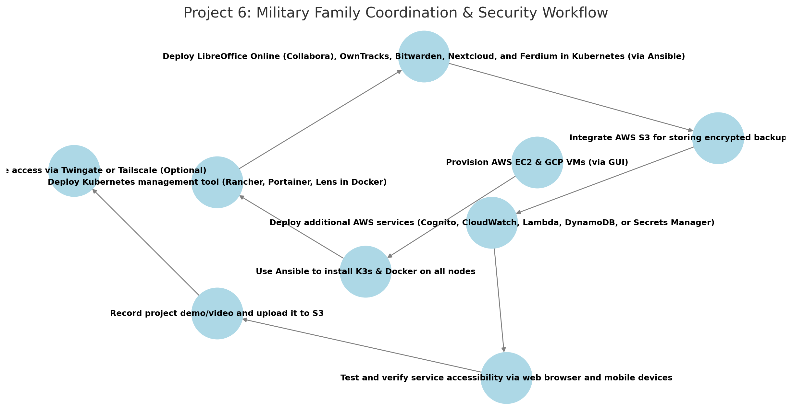

# **AWS Project Thread 6: Military Family Coordination & Security Platform**  

## **📜 Background**  

Military families often experience **frequent relocations, long deployments, and the need for secure communication and document management**. Most commercial platforms—such as **Google Drive, iCloud, Life360, and LastPass**—rely on cloud services that **store personal data externally, track user activity, and require internet access**, making them **unreliable or insecure for military personnel and their families**.  

To address these concerns, the **Unified Cyber Defense (UCD) task force** has commissioned **Cyber Sentinel Solutions (CSS)** to develop a **self-hosted, privacy-focused family coordination platform**. This system will provide **secure document collaboration, real-time location tracking, digital security management, and a unified dashboard**—all without reliance on big tech. **Families, deployed personnel, and off-grid teams** will have complete control over their data, ensuring **mission security, personal privacy, and operational continuity**.  

This solution will be deployed across **AWS and GCP**, using **K3s for lightweight container orchestration**, fully automated with **Ansible**, and integrated with **self-hosted security and family management tools** to create a **resilient, independent, and secure digital ecosystem**.  

---

## **📌 Military & Family Coordination Use Cases**  
- Provides **self-hosted, private alternatives** to Google Drive, iCloud, OneDrive, Life360, and LastPass.  
- Enables **secure family document collaboration and data sharing** without reliance on big tech.  
- Ensures **family members can share locations & send emergency alerts** when traveling or deployed.  
- Offers **self-hosted digital security tools** for **password management, identity protection, and secure file storage**.  
- Supports **off-grid, remote, and operational security-conscious individuals** with **full control over personal data**.  

---

## **⚙️ Technical Focus**  
- **Kubernetes Management Tool** provides **cluster monitoring, service orchestration, and deployment control**.  
- **LibreOffice Online (Collabora)** serves as a **self-hosted office suite for document creation, spreadsheets, and presentations**.  
- **OwnTracks** provides **self-hosted, privacy-first real-time family location tracking & emergency check-ins**.  
- **Bitwarden** offers **self-hosted password management & secure credential sharing**.  
- **Nextcloud** enables **family document storage, calendar, and secure data sharing**.  
- **Ferdium** integrates all services into a **single, unified dashboard**.  
- **K3s-based Kubernetes cluster** deployed across **AWS and GCP** for redundancy.  
- **Ansible automation** for **streamlined installation and configuration**.  
- **AWS services** such as **S3 for encrypted storage, Cognito for identity management, and CloudWatch for security monitoring** can be integrated to enhance functionality.  

---

## **📌 Project Requirements**  

### ✅ **Deploy 4-5 Virtual Machines** *(via AWS & GCP GUI)*  
- **3 in AWS** (EC2 instances)  
- **1-2 in GCP** (Compute Engine VMs)  

### ✅ **Use Ansible to Automate**  
- **Install K3s & Docker** on all nodes.  
- **Deploy Kubernetes management tool** *(Rancher, Portainer, or Lens - deployed via Ansible in a standalone Docker container.)*  
- **Deploy all self-hosted family security & coordination tools in K3s**.  

### ✅ **Deploy & Expose the Following Services** *(Accessible via Browser & Mobile Apps)*  
- **Kubernetes Management Tool** *(Rancher, Portainer, or Lens - deployed via Ansible in a standalone Docker container.)*  
- **LibreOffice Online (Collabora)** *(Self-hosted office suite for document creation, editing, and collaboration.)*  
- **OwnTracks** *(Self-hosted location tracking & real-time family check-ins.)*  
- **Bitwarden** *(Self-hosted password manager for secure credential sharing.)*  
- **Nextcloud** *(Self-hosted family document storage, calendar, and file sharing.)*  
- **Ferdium** *(Unified dashboard for managing family security & coordination tools.)*  

### ✅ **Integrate AWS Services (Total: 5)**  
- **Mandatory AWS Services:**  
  - **EC2** – Hosts the family coordination & security platform.  
  - **S3** – Stores encrypted family documents, location logs, and chat backups.  

- **Select 3 additional AWS services to enhance your project. Below are 5 recommended options:**  
  - **AWS Cognito** – Provides secure authentication & identity management for family members.  
  - **AWS CloudWatch** – Monitors system uptime and alerts for security threats.  
  - **AWS Lambda** – Automates alerts for family location tracking and secure backup tasks.  
  - **AWS DynamoDB (Optional)** – Stores real-time location tracking logs in a NoSQL database.  
  - **AWS Secrets Manager** – Securely stores passwords, API keys, and encryption keys.  

---

### ✅ **Upload & Access Demo Content**  
- **Record a project demo/video** and upload to an **S3 bucket**.  
- **Ensure all family security & coordination services are accessible via browser and mobile apps.**  

### ✅ *(Optional)* Secure Remote Access with Twingate or Tailscale  
- **If required, implement Twingate for secure external access to self-hosted services.**  

---

## **🛠 Role of Each Tool**  

### **AWS Services**  
- **EC2** – Hosts 3 virtual machines for the family coordination & security platform.  
- **S3** – Stores encrypted backups, chat logs, and family files.  
- **Cognito (Optional)** – **Provides secure family login & authentication**.  
- **CloudWatch (Optional)** – **Monitors system uptime & alerts family members to outages**.  
- **Lambda (Optional)** – **Automates security & tracking alerts**.  
- **DynamoDB (Optional)** – **Stores real-time location tracking data**.  
- **Secrets Manager (Optional)** – **Stores passwords & encryption keys securely**.  

---

### **Ansible**  
- **Install K3s** on all nodes.  
- **Install Docker** on the machine hosting the Kubernetes management tool.  
- **Deploy Kubernetes management tool** *(Rancher, Portainer, or Lens in a standalone Docker container.)*  
- **Deploy all family coordination & security services** *(LibreOffice Online, OwnTracks, Bitwarden, Nextcloud, Ferdium) in Kubernetes.*  

---

## **📌 Recommended Workflow**  

```plaintext
1️⃣ Provision AWS EC2 & GCP VMs (via GUI)
2️⃣ Use Ansible to install K3s & Docker on all nodes
3️⃣ Deploy the Kubernetes management tool (Rancher, Portainer, or Lens) in a standalone Docker container via Ansible
4️⃣ Deploy LibreOffice Online (Collabora), OwnTracks, Bitwarden, Nextcloud, and Ferdium in Kubernetes using linuxserver.io container images
5️⃣ Integrate AWS S3 for storing encrypted backups and family data
6️⃣ Deploy mandatory AWS services (EC2, S3) and select 3 additional AWS services (e.g., Cognito, CloudWatch, Lambda)
7️⃣ Test and verify service accessibility via web browser and mobile devices
8️⃣ Record a project demo/video and upload it to S3
9️⃣ Optionally, secure remote access with Twingate or Tailscale
```
## Workflow Diagram

