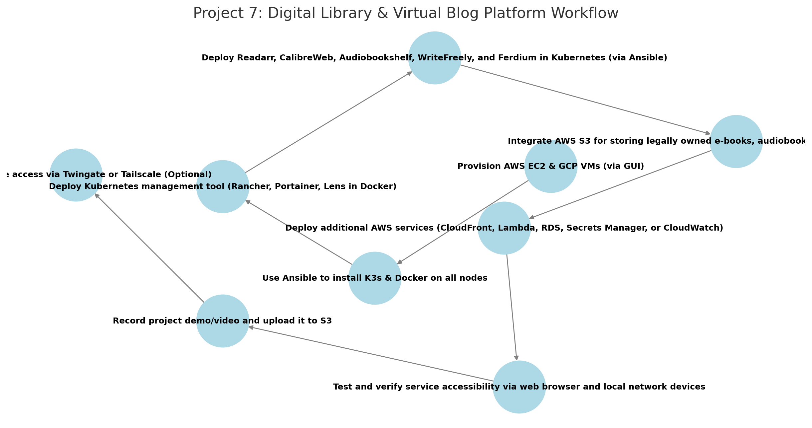

# **AWS Project Thread 7: Digital Library & Virtual Blog Platform**  

## **📜 Background**  

The **U.S. military** frequently operates in **remote environments** where **internet-based knowledge resources may be inaccessible** due to **security restrictions, lack of connectivity, or reliance on proprietary cloud services**. Military personnel need a **centralized, private digital library** to store and access **training manuals, research papers, doctrine, and personal development resources**, as well as an **internal blogging/documentation platform** for knowledge sharing.  

Additionally, **audiobooks and e-books** are crucial for **learning and morale**, making **a self-hosted audiobook streaming platform** an essential component of this project.  

To meet these needs, the **Unified Cyber Defense (UCD) task force** has commissioned **Cyber Sentinel Solutions (CSS)** to build a **self-hosted digital library and blog platform** that allows **secure, offline access to military-relevant e-books, research archives, audiobooks, and knowledge repositories**.  

This solution will be deployed across **AWS and GCP**, using **K3s for lightweight container orchestration**, fully automated with **Ansible**, and integrated with **AWS services for storage, automation, and content delivery**.  

---

## **📌 Military Application**  
- Provides a **self-hosted digital library, audiobook service, and blog platform** for knowledge preservation.  
- Ensures **offline access to legally acquired military manuals, doctrine, technical references, and audiobooks**.  
- Enables **unit-level blogs, internal documentation, and knowledge sharing** without reliance on external services.  
- Supports **automated e-book acquisition, metadata tagging, and structured organization of legally owned or open-source materials**.  
- Enhances **training, professional development, and morale** by keeping critical books and research materials readily available.  

---

## **⚙️ Technical Focus**  
- **Kubernetes Management Tool** provides **cluster monitoring, service orchestration, and deployment control**.  
- **Readarr** serves as an **automated tool for managing legally acquired e-books, research papers, and open-source publications**.  
- **CalibreWeb** provides a **self-hosted e-book server and web-based library interface**.  
- **Audiobookshelf** serves as the **self-hosted audiobook management and streaming platform for legally owned or public domain audiobooks**.  
- **WriteFreely** powers a **self-hosted, minimalistic blogging platform** for documentation and knowledge-sharing.  
- **Ferdium** integrates all tools into a **single, unified dashboard**.  
- **K3s-based Kubernetes cluster** deployed across **AWS and GCP** for redundancy.  
- **Ansible automation** for **streamlined installation and configuration**.  
- **AWS services** such as **S3 for document storage, CloudFront for caching, and Lambda for automation** can be integrated to enhance functionality.  

---

## **📌 Project Requirements**  

### ✅ **Deploy 4-5 Virtual Machines** *(via AWS & GCP GUI)*  
- **3 in AWS** (EC2 instances)  
- **1-2 in GCP** (Compute Engine VMs)  

### ✅ **Use Ansible to Automate**  
- **Install K3s & Docker** on all nodes.  
- **Deploy Kubernetes management tool** *(Rancher, Portainer, or Lens - deployed via Ansible in a standalone Docker container.)*  
- **Deploy all digital library, audiobook, and blogging tools in K3s**.  

### ✅ **Deploy & Expose the Following Knowledge Management Services** *(Accessible via Browser & Local Network Devices)*  
- **Kubernetes Management Tool** *(Rancher, Portainer, or Lens - deployed via Ansible in a standalone Docker container.)*  
- **Readarr** *(Automated organization of legally acquired e-books, research papers, and open-access literature.)*  
- **CalibreWeb** *(Self-hosted e-book library and web-based interface for legal and open-source books.)*  
- **Audiobookshelf** *(Self-hosted audiobook streaming platform for legally owned or public domain audiobooks.)*  
- **WriteFreely** *(Self-hosted blogging and documentation platform.)*  
- **Ferdium** *(Unified dashboard for managing all services.)*  

### ✅ **Integrate AWS Services (Total: 5)**  
- **Mandatory AWS Services:**  
  - **EC2** – Hosts the digital library, audiobook service, and blogging platform.  
  - **S3** – Stores legally owned e-books, blog posts, and audiobook files.  

- **Select 3 additional AWS services to enhance your project. Below are 5 recommended options:**  
  - **AWS CloudFront** – Caches and accelerates content delivery for faster access.  
  - **AWS Lambda** – Automates document processing, metadata extraction, and updates.  
  - **AWS RDS** – Provides managed relational database storage for metadata and blogs.  
  - **AWS Secrets Manager** – Securely stores credentials and API keys.  
  - **AWS CloudWatch** – Monitors system health, service uptime, and performance.  


### ✅ **Upload & Access Demo Content**  
- **Record a project demo/video** and upload to an **S3 bucket**.  
- **Ensure all knowledge management services are accessible via web browser and local network devices.**  

### ✅ *(Optional)* Secure Remote Access with Twingate or Tailscale  
- **If required, implement Twingate for secure external access to the digital library and blogging platform.**  

---

## **🛠 Role of Each Tool**  

### **AWS Services**  
- **EC2** – Hosts 3 virtual machines for the knowledge management platform.  
- **S3** – Stores legally owned e-books, audiobooks, blog posts, and demo recordings.  
- **CloudFront (Optional)** – **Speeds up access to e-books, audiobooks, and blog posts**.  
- **Lambda (Optional)** – **Automates metadata extraction, blog updates, and document indexing**.  
- **RDS (Optional)** – **Manages structured data storage for the blog platform**.  
- **Secrets Manager (Optional)** – **Secure storage for API keys and credentials**.  
- **CloudWatch (Optional)** – **Monitors uptime and performance metrics**.  

---

### **Ansible**  
- **Install K3s** on all nodes.  
- **Install Docker** on the machine hosting the Kubernetes management tool.  
- **Deploy Kubernetes management tool** *(Rancher, Portainer, or Lens in a standalone Docker container.)*  
- **Deploy all digital library, audiobook, and blog platform services** *(Readarr, CalibreWeb, Audiobookshelf, WriteFreely, Ferdium) in Kubernetes.*  

---

## **📌 Recommended Workflow**  

```plaintext
1️⃣ Provision AWS EC2 & GCP VMs (via GUI)
2️⃣ Use Ansible to install K3s & Docker on all nodes
3️⃣ Deploy the Kubernetes management tool (Rancher, Portainer, or Lens) in a standalone Docker container via Ansible
4️⃣ Deploy Readarr, CalibreWeb, Audiobookshelf, WriteFreely, and Ferdium in Kubernetes using linuxserver.io container images
5️⃣ Integrate AWS S3 for storing legally owned e-books, audiobooks, documentation, and blog posts
6️⃣ Deploy mandatory AWS services (EC2, S3) and select 3 additional AWS services (e.g., CloudFront, Lambda, RDS)
7️⃣ Test and verify service accessibility via web browser and local network devices
8️⃣ Record a project demo/video and upload it to S3
9️⃣ Optionally, secure remote access with Twingate or Tailscale
```

## Workflow Diagram

